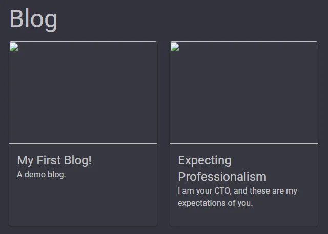

I recently discovered that the Microsoft Edge browser still does not support `.avif` format images!


**❌ Figure: Broken Images**

`.avif` is a relatively new image format with superior compression and quality compared to `.jpg`, `.png`, and even `.webp` formats.

The best way to support image format fallback in the browser is by using the `<picture>` element, with a `<source>` element for each image format you can provide.

```html
<picture>
    <source srcset="image.avif" type="image/avif">
    <source srcset="image.webp" type="image/webp">
    
</picture>
```

The browser will choose the first `<source>` element that it supports, falling back to the src image in the `` element if none are supported.

Unfortunately, MudBlazor (the Blazor UI framework I use to build this blog 😊) does not yet implement a `<picture>` element, such as `<MudPicture/>`, so let's build a custom Blazor component to componentize our solution!

I will create a new razor component called **CustomImage.razor**:

```csharp
<picture>
    <source srcset="image.avif" type="image/avif">
    <source srcset="image.webp" type="image/webp">
    
</picture>

@code {
    [Parameter]
    public string Src { get; set; } = default!;
}
```

We need to support multiple image formats, so let's parameterize that!

```csharp
<picture>
    <source srcset="image.avif" type="image/avif">
    <source srcset="image.webp" type="image/webp">
    
</picture>

@code {
    [Parameter]
    public string Src { get; set; } = default!;
    
    [Parameter, EditorRequired]
    public string PreferredExtensionOrder { get; set; } = default!;
}
```

Let's extract the image format extensions from the PreferredExtensionOrder parameter:

```csharp
<picture>
    <source srcset="image.avif" type="image/avif">
    <source srcset="image.webp" type="image/webp">
    
</picture>

@code {
    [Parameter]
    public string Src { get; set; } = default!;
    
    [Parameter, EditorRequired]
    public string PreferredExtensionOrder { get; set; } = default!;
    
    private List<string> _preferredExtensionOrder => PreferredExtensionOrder.Trim().Replace(" ", null).Split(',').ToList();
}
```

Now we can use the `_preferredExtensionOrder` list to generate the `<source>` elements:

```csharp
<picture>
    @foreach(var extension in _preferredExtensionOrder.Take(_preferredExtensionOrder.Count - 1))
    {
        <source srcset="@Src.@extension" type="image/@extension"/>
    }
    
</picture>

@code {
    [Parameter]
    public string Src { get; set; } = default!;
    
    [Parameter, EditorRequired]
    public string PreferredExtensionOrder { get; set; } = default!;
    
    private List<string> _preferredExtensionOrder => PreferredExtensionOrder.Trim().Replace(" ", null).Split(',').ToList();
}
```

I have made some decisions about how this component is used:
* The last extension in the `PreferredExtensionOrder` list is the fallback image format
* The `Src` parameter does not include the file extension

Pretending other people would use this component, lets add some documentation to make our component easy to use!: 

```csharp
<picture>
    @foreach(var extension in _preferredExtensionOrder.Take(_preferredExtensionOrder.Count - 1))
    {
        <source srcset="@Src.@extension" type="image/@extension"/>
    }
    
</picture>

@code {
    /// <summary>
    /// Image source URL, do not include the file extension
    /// </summary>
    [Parameter]
    public string Src { get; set; } = default!;
    
    /// <summary>
    /// Image format extension order, the last extension will be used in the fallback img tag
    /// </summary>
    [Parameter, EditorRequired]
    public string PreferredExtensionOrder { get; set; } = default!;
    
    private List<string> _preferredExtensionOrder => PreferredExtensionOrder.Trim().Replace(" ", null).Split(',').ToList();
}
```

I can replace the `` tag with a `<MudImage>` tag to use the MudBlazor component, and add some more parameters to make the component more flexible:

```csharp
<picture>
    @foreach(var extension in _preferredExtensionOrder.Take(_preferredExtensionOrder.Count - 1))
    {
        <source srcset="@Src.@extension" type="image/@extension"/>
    }
    <MudImage Elevation="@Elevation" Src="@(Src + "." + _preferredExtensionOrder.Last())" Class="@Class" Style="@Style" Height="@Height" Width="@Width" Alt="@Alt" />
</picture>

@code {
    /// <summary>
    /// Image source URL, do not include the file extension
    /// </summary>
    [Parameter, EditorRequired]
    public string Src { get; set; } = default!;
    
    [Parameter]
    public int Elevation { get; set; }
    
    [Parameter]
    public string? Class { get; set; }
    
    [Parameter]
    public string? Style { get; set; }
    
    [Parameter]
    public string? Alt { get; set; }
    
    [Parameter]
    public int? Height { get; set; }
    
    [Parameter]
    public int? Width { get; set; }

    /// <summary>
    /// Image format extension order, the last extension will be used in the fallback img tag
    /// </summary>
    [Parameter, EditorRequired]
    public string PreferredExtensionOrder { get; set; } = default!;
    
    private List<string> _preferredExtensionOrder => PreferredExtensionOrder.Trim().Replace(" ", null).Split(',').ToList();

    protected override void OnParametersSet()
    {
        if (_preferredExtensionOrder.Count < 1)
            throw new ArgumentException("PreferredExtensionOrder must contain at least one image extension");
    }
}
```

Now we can simply replace `<MudImage/>` with `<CustomImage/>`!

From:
```html
<MudImage Src="img/github-profile-pic.avif" Width="300" Height="300" Alt="MattParkerDev's Profile Picture" />
```

To:
```html
<CustomImage Src="img/github-profile-pic" PreferredExtensionOrder="avif,webp,png" Width="300" Height="300" Alt="MattParkerDev's Profile Picture" />
```

And we have a componentized solution for image format fallback in Blazor!


**✅ Figure: Working images in Edge!**